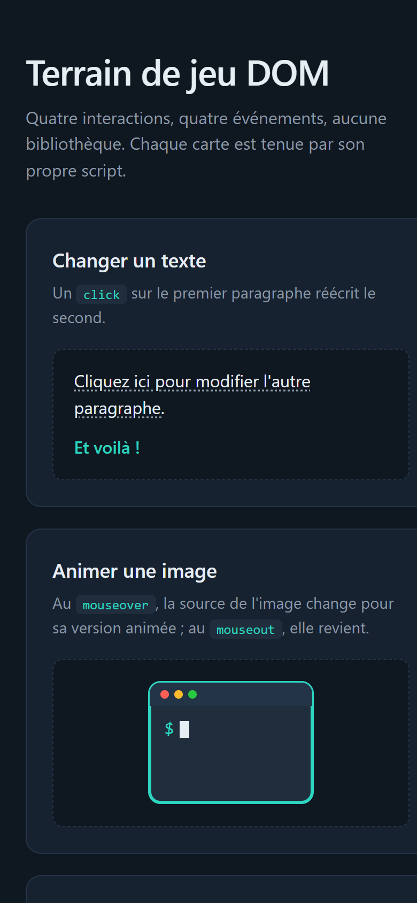

# dom-playground

What does it take to make a page react to a click or to the mouse passing by,
with nothing but the browser? Four cards, one interaction each, one script
each, and no library.

Plain HTML, CSS and JavaScript. No framework, no build step, no dependency:
open the file and try each card.

> The user interface is in French, as is the code vocabulary. This README and
> the repository metadata are in English.

## Screenshots

## How it works

**One script per card, and nothing shared.** `js/texte.js`, `js/image.js`,
`js/couleur.js` and `js/compteur.js` each grab the elements they need by id
and attach their listeners. Removing a card means removing one script tag and
one file; the other three do not notice.

**Every interaction is a listener, never an attribute.** The HTML carries no
`onclick` or `onmouseover`. All wiring happens through `addEventListener`, so
the markup stays pure structure and the behaviour lives in one place.

**The image swap is a source swap.** On `mouseover` the `src` moves from
`images/terminal.svg` to `images/terminal-anime.svg`, and `mouseout` puts it
back. Both icons are hand-drawn SVGs; the animated one carries its own CSS
keyframes, so it animates inside a plain `` with no script of its own.

**The colour change is done by the script, on purpose.** A `:hover` rule would
do it in one line of CSS. Here the paragraph starts black through the
stylesheet and the script sets `style.color` to blue and back, which is the
point of the card: the same effect, driven from JavaScript, on an element that
is not a link.

**The counter keeps its own state.** A single `let clics` next to the button
is the whole memory of the fourth card. Each click increments it and rewrites
the button's text.

## Running it

Open `index.html` in a browser. There is nothing to install.

## Stack

HTML, CSS and vanilla JavaScript. One stylesheet, four scripts, two SVG icons,
no library.

## Résumé

Quatre interactions DOM sur une page, sans bibliothèque : un clic qui réécrit
un paragraphe, une image qui change de source au survol de la souris, un
paragraphe qui passe du noir au bleu sous la souris sans être un lien, et un
bouton qui compte ses propres clics. Chaque carte est tenue par son propre
script, qui prend ses éléments par leur identifiant et pose ses écouteurs
avec `addEventListener` ; le HTML ne porte aucun attribut d'événement. Le
changement de couleur est fait volontairement par le script et non par une
règle `:hover`, puisque c'est le sujet de la carte. Les deux icônes de
terminal sont des SVG dessinés pour le projet, la version animée portant ses
propres images clés CSS. Interface et vocabulaire du code en français.

## Licence

MIT. See [LICENSE](LICENSE).
